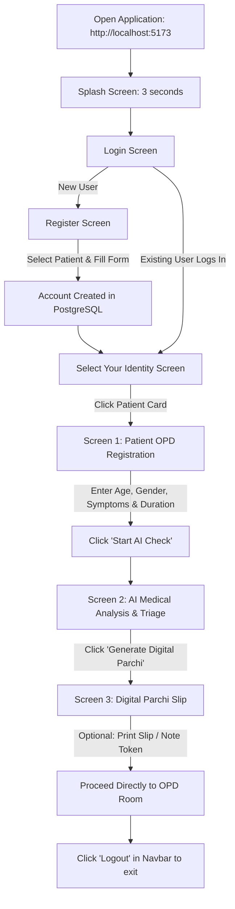
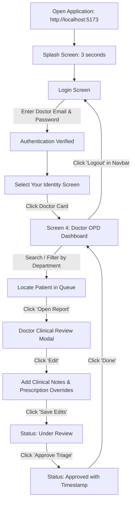

# MediNexus AI – Complete Working Guide

Welcome to the **MediNexus AI User Guide**. This document is a practical, step-by-step user manual and demonstration guide for the **MediNexus AI — AI Medical Assistant & Digital Registration System**.

It covers exactly how to open, operate, and demonstrate the application from both the **Patient** and **Doctor** perspectives based strictly on the features currently implemented in the software.

---

## 1. Starting the Application

### How to Open the Application
1. Ensure both the MediNexus AI backend server (port `3001`) and frontend server (port `5173`) are running.
2. Open any modern web browser (Google Chrome, Microsoft Edge, Mozilla Firefox).
3. In the URL address bar, navigate to:
   ```
   http://localhost:5173/
   ```

### What Appears First: The Splash Screen
When the application first loads in your browser, a full-screen **MediNexus AI Splash Screen** appears:
* **Background:** Deep medical teal gradient (`#0d9488` to `#134e4a`) with soft translucent hospital wave patterns.
* **MediNexus AI Logo:** The official MediNexus AI shield with heart and medical cross emblem.
* **Branding:** "MediNexus AI" title with "AI Medical Assistant" in bold lettering.
* **Tagline:** *"Smarter Diagnosis • Faster Care • Healthier Tomorrow"*.
* **Animations:** A glowing medical pulse heartbeat waveform and animated loading indicators.

### How Long the Splash Screen Appears
* The splash screen displays for **approximately 3 seconds**.
* After 3 seconds, it smoothly fades out over 400 milliseconds.

### Where the User Lands
* **First-time or logged-out users:** Land directly on the **Login Screen** ("Welcome Back — Sign in to access your healthcare dashboard").
* **Already authenticated users (active session):** If you already logged in on that browser, MediNexus AI remembers your session token and takes you directly to the **Select Your Identity / Role** screen.

---

## 2. Login

The Login screen allows both patients and medical staff to access their MediNexus AI portal securely.


### Screen Elements
* **Brand Header:** Teal header card with the MediNexus AI logo and title.
* **Welcome Card:** Contains the sign-in form with clear labels and input icons.
* **CNIC / National ID or Email Input:** A flexible field that accepts either a National CNIC number (e.g., `35201-1234567-1`) or an Email address (e.g., `doctor.test@smartcare.com`).
* **Password Input with Visibility Toggle:** An eye icon button on the right allows revealing or hiding your password while typing.
* **Sign In Button:** Gradient teal button featuring a heart-pulse icon and arrow indicator.
* **Register Link:** A text link at the bottom: *"Don't have an account? Register"*.

### Step-by-Step Login Instructions
1. Open the application and wait for the splash screen to finish.
2. In the **CNIC / National ID or Email** field, type your registered CNIC or Email address.
3. In the **Password** field, type your secret password.
4. *(Optional)* Click the **Eye icon** on the right side of the password field to verify that you entered the characters correctly. Click it again to mask it.
5. Click the **Sign In** button.

### What Happens on Successful Login
* The button switches to a spinning indicator with *"Signing in…"*.
* The backend verifies your password hash and issues a secure authorization token (JWT) stored in your browser session.
* You are immediately redirected to the **Select Your Identity / Role** screen.

### What Happens on Incorrect Credentials
* If either field is left blank, a warning alert displays:  
  `⚠ Please enter your CNIC/Email and password.`
* If the credentials do not match an existing registered user, a red alert box appears:  
  `⚠ Invalid credentials.`
* The system remains on the Login screen, allowing you to re-type your information.

---

## 3. Patient Registration

If a patient does not yet have an account, they must create one through the Registration screen before they can log in.


### Step-by-Step Registration
1. On the **Login Screen**, click the **Register** link next to *"Don't have an account?"*.
2. The **Create Your Account** screen opens.
3. **Select Role:** Click the **Patient** tab at the top (highlighted in teal).
4. **Enter Full Name:** Type the patient's full name (e.g., `Ayesha Khan`). *(Required)*
5. **Enter CNIC / National ID:** Type a valid National ID or CNIC number (e.g., `42101-5678901-2`). *(Required and must be unique)*
6. **Enter Phone Number:** Type a contact phone number (e.g., `03001234567`). *(Optional)*
7. **Enter Email Address:** Type an email address (e.g., `ayesha@example.com`). *(Optional, but must be unique if entered)*
8. **Enter Password:** Type a secure password of at least 6 characters. *(Required)*
9. **Confirm Password:** Re-type the exact same password. *(Required)*
10. **Accept Terms:** Check the box next to **"I agree to the Terms & Conditions"**. *(Required)*
11. Click the **Register** button.

### Validation & Error Messages That Can Appear
* **Missing required fields:** `⚠ Please fill in all required fields.`
* **Passwords do not match:** `⚠ Passwords do not match.`
* **Short password:** `⚠ Password must be at least 6 characters.`
* **Unchecked terms:** `⚠ Please agree to the Terms & Conditions.`
* **Duplicate CNIC:** `⚠ An account with this CNIC already exists.`
* **Duplicate Email:** `⚠ An account with this email already exists.`

### What Happens After Successful Registration
1. The backend securely encrypts the password with `bcryptjs` and saves the user record to PostgreSQL.
2. A new session token is created and stored in your browser.
3. You are automatically signed in and taken straight to the **Select Your Identity / Role** screen without having to re-enter your credentials.

---

## 4. Patient Login

### Important Notice
> **A patient cannot log in using random or unregistered credentials.**  
> MediNexus AI validates every login against real user records in PostgreSQL. Before logging in as a patient, you must first register an account via Section 3 above.

### How an Existing Patient Logs In
1. Navigate to the MediNexus AI URL (`http://localhost:5173/`).
2. On the **Login Screen**, type the **CNIC** or **Email** used during registration.
3. Type the **Password** you chose during registration.
4. Click **Sign In**.
5. Upon successful authentication, you arrive at the **Select Your Identity / Role** screen.
6. Click the **Patient** card to enter the Patient OPD flow.

---

## 5. Patient Dashboard & Clinical Workflow

When a patient enters the system, they follow a guided 3-screen workflow designed to eliminate physical hospital queues:

```
[Screen 1: Patient Registration] ──▶ [Screen 2: AI Medical Analysis] ──▶ [Screen 3: Digital Parchi Slip]
```

### Screen 1: Patient Demographics & Symptoms Pre-Registration


#### 1. Top Hospital Announcement Bar
* **Hackathon MVP Badge:** Indicates active operational mode for General Medicine & Dermatology.
* **Quick Test Pre-loaders:**
  * **"Load Fever/Cough Demo" Button:** Automatically pre-fills a high-risk fever test case (`Ramesh Verma`, 54, Male, Fever + Cough + Body pain, 1–2 weeks) and submits it directly.
  * **"Skin Rash Demo" Button:** Automatically pre-fills an acute dermatology test case (`Priya Sharma`, 27, Female, Skin rash + Itching + Redness, 3–5 days) and submits it directly.
  * **"Reset" Button:** Clears all form fields back to empty.
  * **"Logout" Button:** Clears session and logs out of the app.

#### 2. Digital OPD Pre-Check Hero Banner
* Explains the hospital queue-reduction mission: *"Saves 45–60 mins queue time"* and *"Direct routing to OPD Room"*.

#### 3. Step 1 — Basic Demographics Form
* **Full Name (Optional):** Enter patient name (e.g. `Hina Fatima`). Patients can leave this blank to remain anonymous.
* **Age (Required):** Enter age between `1` and `120`.
* **Gender (Required):** Select `Male`, `Female`, or `Other` from the dropdown.

#### 4. Step 2 — Presenting Symptoms Selection
Symptoms are categorized into two active hospital OPD departments:
* **Department 1: General Medicine (Room 104):**
  * `Fever` (Elevated body temperature / chills)
  * `Flu` (Systemic viral malaise and exhaustion)
  * `Headache` (Cephalea or tension/pressure pain)
  * `Cough` (Persistent dry or productive chest cough)
  * `Sore throat` (Pharyngeal irritation or pain on swallowing)
  * `Body pain` (Generalized myalgia and joint stiffness)
* **Department 2: Dermatology (Room 208):**
  * `Skin rash` (Erythematous eruption or maculopapular lesions)
  * `Itching` (Pruritus, localized or generalized)
  * `Redness` (Cutaneous erythema or localized inflammation)
  * `Minor skin infection` (Superficial pustule, folliculitis or mild cellulitis)

*How to use:* Click on any symptom card to select it (turns solid blue for General Medicine or solid amber for Dermatology). Click again to deselect. You can select multiple symptoms across departments.

#### 5. Step 3 — Duration of Symptoms
Select how long the symptoms have been present:
* `Today (Sudden onset)`
* `1 - 2 days`
* `3 - 5 days`
* `1 - 2 weeks`
* `More than 2 weeks`

#### 6. Action: Start AI Check Button
* Click **Start AI Check** (bottom right with sparkles).
* The button switches to a spinner showing *"Registering…"*.
* The patient record is stored in PostgreSQL and MediNexus AI automatically transitions to **Screen 2: AI Medical Analysis**.

---

### Screen 2: AI Medical Analysis

Screen 2 presents an instant, transparent clinical pre-triage summary of the patient's condition.

#### 1. Mandatory Medical Disclaimer Banner
* A prominent amber alert at the top states:  
  **"AI-GENERATED ASSESSMENT — REQUIRES DOCTOR REVIEW"**  
  Explains that MediNexus AI assists initial triage and queue routing but does NOT replace a licensed physician.

#### 2. Patient Summary Header Card
* Displays Patient Name, Age, Gender, presenting symptoms, duration, and the unique assigned **Token Number** (e.g., `DERM-03` or `GM-01`).

#### 3. Triage Risk Level Hierarchy Card
* **Risk Badge:** Color-coded priority classification:
  * **HIGH RISK / PRIORITY TRIAGE (Red):** Potential red flags detected; immediate clinical assessment recommended.
  * **MEDIUM RISK / SAME-DAY REVIEW (Amber):** Significant symptoms requiring timely evaluation.
  * **LOW RISK / STANDARD OPD (Green):** Stable presentation suitable for routine outpatient consultation.
* **Risk Scale Meter:** A three-stage visual spectrum showing Low, Medium, or High risk.
* **AI Triage Confidence:** Displays the model's confidence rating (e.g., `94%`).

#### 4. Red Flags & Clinical Warnings Section
* Bulleted clinical alerts identifying critical issues (e.g., prolonged febrile respiratory illness, bacterial infection risk, or stability notices).

#### 5. Suggested Department & Possible Conditions Grid
* **Suggested Department Card:** Names the recommended clinic (e.g., `Dermatology`) and specific hospital door (e.g., `Room 208`).
* **Possible Conditions (Differential Considerations):** Ranked list of preliminary medical considerations for the examining doctor (e.g., `Allergic Contact Dermatitis`, `Acute Urticaria`).

#### 6. Recommended Action & Doctor Handover Summary
* **Recommended Action:** Actionable instructions for the patient (e.g., avoid self-medication, keep hydrated, report immediately to Room 208).
* **Doctor Handover Summary (SBAR Format):** A concise, pre-compiled clinical summary in monospace font that saves the attending physician up to 70% in manual documentation time.

#### 7. Navigation Buttons
* **"Edit Symptoms" Button (Left):** Returns to Screen 1 to modify age, gender, or symptoms.
* **"Generate Digital Parchi (Slip)" Button (Right):** Proceeds to the official registration slip (Screen 3).

---

### Screen 3: Digital Parchi (Outpatient Slip)

Screen 3 is the hospital-ready electronic appointment slip ("Parchi") that replaces physical paper queue tickets.

#### 1. Queue-Elimination Top Banner
* Confirms: *"Digital Parchi Generated Successfully — No physical registration queue required. Present this token number directly at Room 208."*
* **"Print / Save Slip" Button:** Triggers the browser's native print dialogue to save as PDF or print a hard copy.
* **"Doctor Dashboard" Button:** Quick navigation link for doctors or staff.

#### 2. The Digital Parchi Slip Card
* **Hospital Header:** "MediNexus AI Digital OPD System — Outpatient Digital Registration Slip (Parchi)".
* **Token Serial Box:** Large high-contrast token display (e.g., `DERM-03`) with department tag.
* **Required Operational Badges:**
  * `✓ Digital Registration Completed` (Emerald badge)
  * `⚠ Doctor Review Required` (Amber badge)
* **Demographics Summary:** Patient ID (`SC-2026-XXXX`), Patient Name, Age/Gender, Assigned OPD Room.
* **Clinical Triage Information:** Department routing, Triage Risk Level, Reported Symptoms, Red Flags assessment, and AI Pre-Triage Handover Summary.
* **Verification QR Code:** A scannable electronic validation QR block for the OPD door nurse or doctor desk scanner.

#### 3. Bottom Navigation
* **"Back to AI Medical Analysis":** Returns to Screen 2.
* **"Open Doctor Dashboard (Screen 4)":** Takes medical staff directly to the physician workstation.

---

## 6. Doctor Login

Doctor access provides full clinical control to inspect queues, review patient triage reports, edit clinical notes, and approve consultations.


### Key Rules for Doctor Access
1. Doctor accounts are designated with the `doctor` role in the PostgreSQL database.
2. For testing and project evaluation, an authorized **Demo Doctor Account** is pre-configured in the system.
3. *(Security note: The actual password is provided in team submission credentials and is never exposed in public documentation).*

### Step-by-Step Doctor Sign-In
1. Open the MediNexus AI Login screen.
2. In the **CNIC / National ID or Email** field, enter the authorized doctor email:
   ```
   doctor.test@smartcare.com
   ```
   *(Or enter the doctor's registered CNIC: `35201-1234567-1`)*
3. In the **Password** field, enter the authorized doctor password.
4. Click **Sign In**.
5. The **"Select Your Identity / Role"** screen appears.
6. Click on the **Doctor** card (*"Doctor / Medical Staff — Access patient records, manage appointments and provide care"*).
7. The system immediately opens the **Physician OPD Triage Dashboard (Screen 4)**.

---

## 7. Doctor Dashboard (Screen 4)

The Doctor Dashboard is the attending physician's command center.


### Dashboard Components

#### 1. Header Bar
* **Title:** Physician OPD Triage Dashboard.
* **"Refresh" Button:** Immediately reloads all patient records from PostgreSQL.
* **"+ Register New Patient" Button:** Clears the active patient state and opens Screen 1 for a new patient intake.

#### 2. Live Triage Metrics Cards
* **Total Queue:** Real-time counter of all patients digitally registered in the system.
* **High Risk Priority:** Counter of patients flagged as High Risk requiring urgent attention.
* **Awaiting Review:** Counter of patients currently awaiting physician sign-off.

#### 3. Department Filters & Search
* **Department Filter Buttons:** Click **All**, **General Medicine**, or **Dermatology** to instantly filter the table.
* **Live Search Box:** Type any text to instantly filter by:
  * Patient Name (e.g., `hina`)
  * Patient ID (e.g., `SC-2026-1715`)
  * Token Serial (e.g., `DERM-03`)
  * Specific Symptom (e.g., `rash` or `fever`)

#### 4. Patients Queue Table
The table displays all registered patients with clear columns:
1. **Token & Patient ID:** Token number in bold monospace with system CUID below.
2. **Patient Demographics:** Name, Age, and Gender.
3. **Department:** Department badge (Blue for General Medicine, Amber for Dermatology).
4. **Presenting Symptoms:** Small gray pills displaying reported symptoms.
5. **Risk Level:** Colored badge with indicator dot (`High` in rose, `Medium` in amber, `Low` in emerald).
6. **Status:** Review status (`Pending Review`, `Under Review`, or `Approved` with a green checkmark).
7. **Actions:** **"Open Report"** button to inspect the patient's full medical record.

---

### Doctor Clinical Review & Triage Modal

Clicking any row or the **"Open Report"** button opens the detailed clinical evaluation window:

#### What the Doctor Can View
* **Patient Demographics:** Full Name, Age, Gender, Department, and current Triage Status.
* **Risk Assessment:** Assessed Risk Level and AI confidence score.
* **Reported Duration:** How long symptoms have persisted.
* **Red Flags & Triage Warnings:** System-flagged clinical risks.
* **AI Pre-Triage Handover Summary:** The instant SBAR summary.
* **Recommended Action / Clinical Plan:** Suggested initial treatment steps.

#### Editing Clinical Notes & Prescriptions
1. In the modal, click the **"Edit"** button (or **"Edit Plan"**).
2. Two editable fields open:
   * **Edit Recommended Action:** Override or tailor the clinical plan.
   * **Doctor Clinical Notes / Prescription Overrides:** Type attending physician notes (e.g., *"Auscultated lungs: clear. Prescribed topical hydrocortisone 1% twice daily for 5 days. Return if erythema spreads."*).
3. Click **Save Edits**:
   * The edits are immediately updated in PostgreSQL.
   * The patient's status changes to **"Under Review"**.

#### Approving a Patient Consultation
1. When the physician has reviewed the patient, click the green **"Approve Triage"** button in the modal footer.
2. The button shows a spinner (*"Approving…"*) and saves the approval to PostgreSQL.
3. The modal updates with:
   * `✓ Consultation & Triage Approved by Doctor`
   * Attending physician attribution: `— Dr. Resident Medical Officer` with exact timestamp.
4. Click **"Done"** to close the modal.
5. In the main dashboard table, the patient's status now shows **"Approved"** with a green checkmark icon.

---

## 8. Patient vs Doctor Comparison

| Feature | Patient | Doctor / Medical Staff |
|---|---|---|
| **Account Access** | Self-registers via the **Register** screen. | Pre-configured authorized account in database. |
| **Login Method** | Enters registered CNIC or Email + personal password. | Enters authorized doctor Email or CNIC + password. |
| **Role Selection** | Selects **Patient** on the Role Selection screen. | Selects **Doctor** on the Role Selection screen. |
| **Landing Screen** | Screen 1: Digital OPD Pre-Registration & Symptoms. | Screen 4: Physician OPD Triage Dashboard. |
| **Available Screens** | Screen 1 (Registration), Screen 2 (AI Analysis), Screen 3 (Digital Parchi). | Screen 4 (Full Dashboard & Review Modal), plus navigation to all screens. |
| **Data Privileges** | Creates their own registration; views their own AI triage and digital slip. | Views all patients in the queue; searches and filters patients. |
| **Clinical Actions** | Submits symptoms and prints digital slip. | Edits clinical notes, overrides recommended actions, approves triage consultations. |

---

## 9. Complete Patient Journey



### Explanation of Steps
1. **Open App:** Patient visits `http://localhost:5173/`.
2. **Splash Screen:** Displays MediNexus AI logo and branding for 3 seconds.
3. **Login / Register:** If new, clicks **Register**, selects **Patient**, completes the form, and accepts terms.
4. **Select Role:** On the Identity selection screen, clicks **Patient**.
5. **Screen 1 (Registration):** Patient inputs age, gender, selects symptoms from General Medicine or Dermatology, chooses duration, and clicks **Start AI Check**.
6. **Screen 2 (AI Analysis):** Patient reviews risk level, red flags, suggested department, and estimated queue routing.
7. **Screen 3 (Digital Parchi):** Digital slip is displayed with unique token serial (e.g., `DERM-03`). Patient prints or saves slip.
8. **Logout:** Patient clicks **Logout** in the top navbar when finished.

---

## 10. Complete Doctor Journey



### Explanation of Steps
1. **Open App:** Doctor visits `http://localhost:5173/`.
2. **Login:** Enters authorized doctor email (`doctor.test@smartcare.com`) and password.
3. **Identity Screen:** Clicks the **Doctor** card.
4. **Dashboard:** Doctor inspects total queue, high-risk patients, and pending reviews.
5. **Search / Filter:** Filters by General Medicine or Dermatology, or searches by patient name/token.
6. **Open Report:** Clicks **Open Report** on a patient to inspect their AI triage summary and red flags.
7. **Clinical Notes:** Adds clinical examination observations or prescription overrides.
8. **Approve:** Clicks **Approve Triage** to finalize the consultation.
9. **Logout:** Doctor logs out via the top navbar.

---

## 11. What Happens Behind the Scenes

### When a User Registers
1. **Frontend Form:** Captures name, CNIC, phone, email, and password.
2. **Validation:** Checks that required fields are filled, passwords match, and password is at least 6 characters.
3. **Backend Service:** Hashes the password using `bcryptjs` with a work factor of 12.
4. **Database:** Saves the new user into the `users` table in PostgreSQL.
5. **Token Issuance:** Creates a signed JSON Web Token (JWT) and returns it to the frontend.
6. **Storage:** Frontend saves the token in browser `localStorage` and marks the user as authenticated.

### When a User Logs In
1. **Frontend:** Sends the CNIC or Email along with the password to `POST /api/auth/login`.
2. **Backend Lookup:** Queries the `users` table in PostgreSQL by CNIC or Email.
3. **Password Check:** Compares the submitted password with the stored bcrypt hash.
4. **Authorization:** If valid, signs a JWT token with user ID and role.
5. **Session Initiation:** Frontend stores the token and redirects to role selection.

### When a Patient Registers Symptoms (Screen 1)
1. **Triage Calculation:** Deterministic medical rules engine evaluates symptoms, age, and duration to calculate Risk Level (Low/Medium/High), red flags, and suggested OPD room.
2. **Database Insertion:** Records the patient, token serial (e.g., `DERM-03`), triage analysis, and review status in PostgreSQL across the `patients`, `triage_results`, and `doctor_reviews` tables.
3. **Immediate Display:** Returns the saved patient record for display in Screen 2 and Screen 3.

### When a Doctor Approves a Patient (Screen 4)
1. **API Call:** Sends doctor notes and approval status to `PATCH /api/patients/:id/approve`.
2. **Database Update:** Updates the `doctor_reviews` table with `status = "Approved"`, `approvedBy = "Dr. Resident Medical Officer"`, and the current timestamp.
3. **Live Sync:** The dashboard table updates the patient badge to green "Approved".

### When a User Logs Out
1. **Token Purged:** The JWT token is cleared from `localStorage`.
2. **State Reset:** All active patient form data and cached session state are reset.
3. **Navigation:** The user is immediately redirected to the Login screen.

---

## 12. Error Scenarios & How to Resolve Them

| What the User Sees | Cause | How to Resolve |
|---|---|---|
| `⚠ Please enter your CNIC/Email and password.` | Left one or both login fields empty. | Type your registered CNIC or Email and your password before clicking Sign In. |
| `⚠ Invalid credentials.` | Wrong password or unregistered CNIC/Email entered. | Check your spelling, verify your credentials, or click Register to create a new account. |
| `⚠ Please fill in all required fields.` | Omitted Full Name, CNIC, Password, or Confirm Password during registration. | Fill out all fields marked with an asterisk (`*`). |
| `⚠ Passwords do not match.` | The password in "Confirm Password" does not match "Password". | Re-enter both password fields carefully. Use the Eye icon to view them. |
| `⚠ Password must be at least 6 characters.` | Password is under 6 characters long. | Enter a password with 6 or more characters. |
| `⚠ Please agree to the Terms & Conditions.` | The terms checkbox was left unchecked. | Check the box next to *"I agree to the Terms & Conditions"*. |
| `⚠ An account with this CNIC already exists.` | A user with this CNIC is already registered in PostgreSQL. | Log in using this CNIC, or register using a different CNIC number. |
| `⚠ An account with this email already exists.` | A user with this email is already registered. | Log in with this email, or register using a different email. |
| `Please provide a valid age between 1 and 120.` | Age left blank or outside 1–120 range on Screen 1. | Type a valid age number (e.g., `25`). |
| `Please select a gender.` | Gender dropdown left on default. | Select `Male`, `Female`, or `Other`. |
| `Please select at least one primary symptom.` | No symptom cards clicked on Screen 1. | Click at least one symptom card in General Medicine or Dermatology. |
| `Please select the duration of your symptoms.` | No duration button selected on Screen 1. | Click one of the 5 duration buttons (e.g. `3 - 5 days`). |
| `Backend Error: Registration failed...` | Backend server on port `3001` or PostgreSQL is offline. | Verify the backend server is running (`npm run dev` in `backend/`). |

---

## 13. Step-by-Step Demonstration Flow (For Judges / Evaluators)

When demonstrating MediNexus AI to a teacher, judge, or hackathon panel, use this recommended 10-step sequence:

1. **Show Splash Screen:** Open `http://localhost:5173/` and let the 3-second branded splash screen play.
2. **Show Login Screen:** Point out the clean UI, CNIC/Email flexibility, and password show/hide toggle.
3. **Register a New Patient:**
   * Click **Register**.
   * Select the **Patient** tab.
   * Enter a test patient: Name: `Hina Fatima`, CNIC: `35201-9999999-1`, Password: `Password123`, Confirm Password: `Password123`.
   * Check Terms & Conditions and click **Register**.
4. **Select Role:** On the Identity screen, show both cards and click **Patient**.
5. **Demonstrate Screen 1 (OPD Pre-Registration):**
   * Explain the OPD queue-reduction goal.
   * Click the quick **"Fever Case"** preloader button to auto-fill the form, or select custom symptoms.
   * Click **Start AI Check**.
6. **Demonstrate Screen 2 (AI Analysis):**
   * Highlight the mandatory **Medical Disclaimer** banner.
   * Point out the color-coded **Risk Level Hierarchy** (Low/Medium/High) and confidence score.
   * Show the pre-compiled **Doctor Handover Summary** that saves doctors documentation time.
   * Click **Generate Digital Parchi (Slip)**.
7. **Demonstrate Screen 3 (Digital Parchi):**
   * Show the printable outpatient slip, the unique Token Number (`GM-...` or `DERM-...`), the status badges, and the verification QR code.
   * *(Optional)* Click **Print / Save Slip** to show the browser print dialog.
8. **Logout:** Click **Logout** in the top navbar to return to the Login screen.
9. **Login as Doctor:**
   * Enter the authorized demo doctor credentials: `doctor.test@smartcare.com` with the test password.
   * Click **Sign In**.
   * On the Identity screen, click **Doctor**.
10. **Demonstrate Doctor Dashboard (Screen 4):**
    * Show live queue counters (Total Queue, High Risk, Awaiting Review).
    * Use the **Search Bar** to find the patient just created (`Hina Fatima` or by token).
    * Click **Open Report**.
    * Click **Edit**, add a doctor clinical note, and click **Save Edits**.
    * Click **Approve Triage** to show the real-time status update to **Approved**.
    * Click **Logout** in the navbar to conclude the demonstration.

---

## 14. Quick Reference

| Action | Where to Click | What Happens |
|---|---|---|
| **Open App** | Navigate to `http://localhost:5173/` | Branded 3-second splash screen opens, then transitions to Login. |
| **Register Patient** | Login screen → click **Register** link | Opens account registration form with Patient and Doctor role options. |
| **Patient Login** | Login screen → enter CNIC/Email + password → **Sign In** | Authenticates user; opens Role Selection screen. |
| **Select Patient Role** | Role Selection screen → click **Patient** card | Navigates to Screen 1: OPD Registration & Symptoms. |
| **Auto-fill Test Patient** | Screen 1 or Navbar → click **Fever Case** or **Skin Case** | Instantly populates demographics and symptoms for fast testing. |
| **Run AI Triage** | Screen 1 → click **Start AI Check** | Evaluates clinical symptoms, saves to PostgreSQL, and opens Screen 2. |
| **Generate Digital Parchi** | Screen 2 → click **Generate Digital Parchi (Slip)** | Opens Screen 3 with printable electronic OPD ticket and QR code. |
| **Print / Save Parchi** | Screen 3 → click **Print / Save Slip** | Opens browser print/PDF preview dialog. |
| **Doctor Login** | Login screen → enter doctor email + password → **Sign In** | Authenticates doctor account; opens Role Selection screen. |
| **Select Doctor Role** | Role Selection screen → click **Doctor** card | Navigates directly to Screen 4: Doctor OPD Dashboard. |
| **Filter Department** | Doctor Dashboard → click **General Medicine** or **Dermatology** | Filters patient table by selected department. |
| **Search Patients** | Doctor Dashboard → type in Search box | Filters queue table by patient name, ID, token, or symptom. |
| **Review Patient** | Doctor Dashboard → click **Open Report** on any row | Opens modal with AI triage summary, red flags, and clinical tools. |
| **Add Clinical Notes** | Doctor Review Modal → click **Edit** → enter notes → **Save Edits** | Saves doctor notes to PostgreSQL; updates status to "Under Review". |
| **Approve Consultation** | Doctor Review Modal → click **Approve Triage** | Saves approval in PostgreSQL; marks patient status as "Approved". |
| **Logout** | Top Navbar (or Role Select) → click **Logout** | Clears session token and returns to Login screen. |
